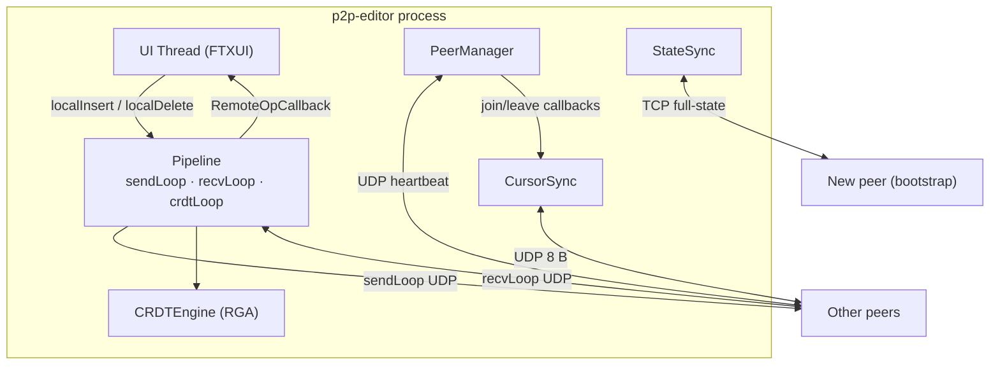
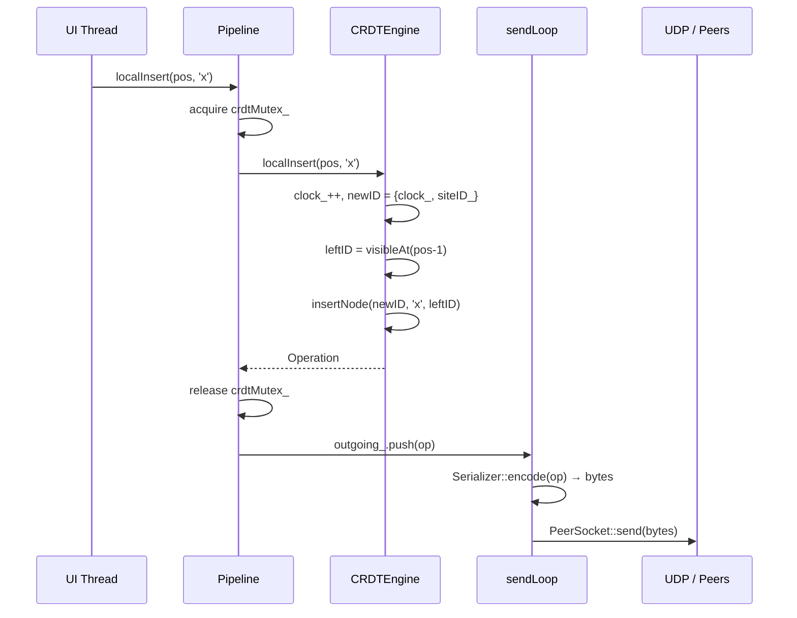
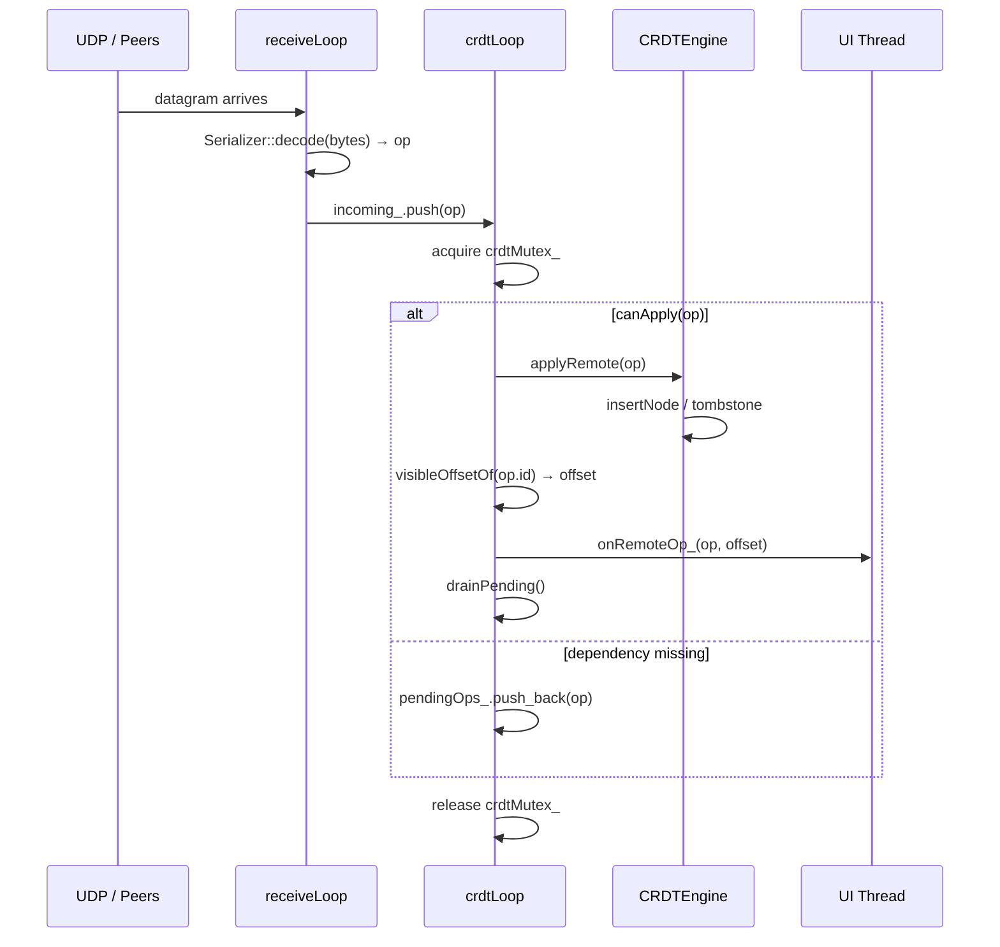
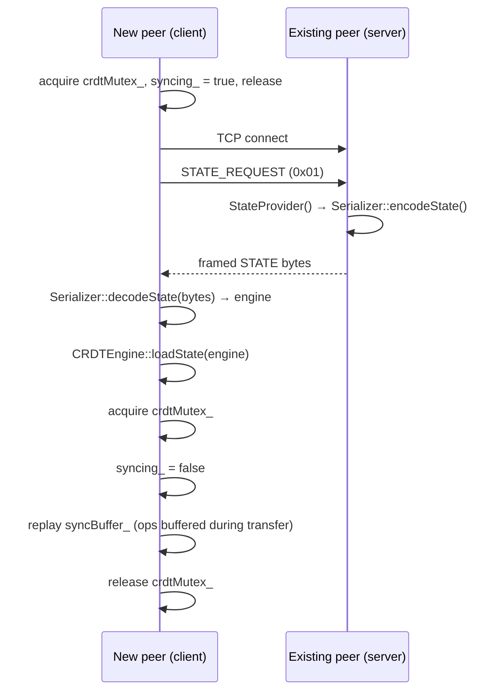
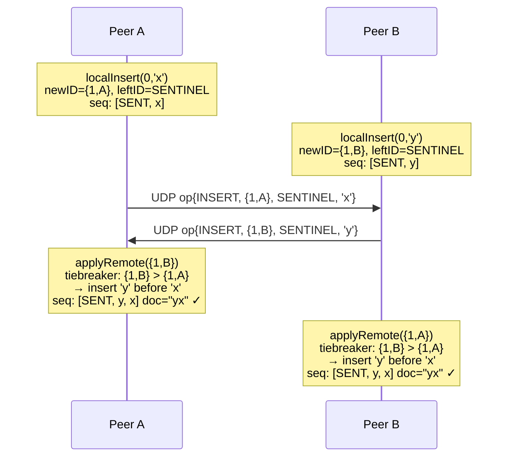
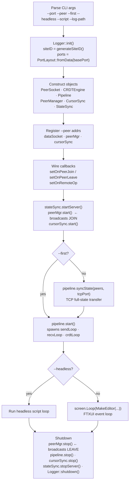

# Architecture

This document describes every module in the p2p collaborative text editor, how they communicate, and the CRDT algorithm that ensures convergence.

## Table of contents

1. [System overview](#1-system-overview)
2. [Module descriptions](#2-module-descriptions)
3. [Data flow](#3-data-flow)
4. [CRDT algorithm — RGA](#4-crdt-algorithm--rga)
5. [Threading model](#5-threading-model)
6. [Wire protocols](#6-wire-protocols)
7. [Port layout](#7-port-layout)
8. [Startup sequence](#8-startup-sequence)

---

## 1. System overview

The system is a fully decentralised (P2P) collaborative text editor. There is no central server — every peer holds a complete, authoritative copy of the document and exchanges operations directly with every other peer over UDP.

Correctness is guaranteed by a **Conflict-free Replicated Data Type (CRDT)**: regardless of the order in which operations arrive, every peer converges to an identical document. Late-joining peers bootstrap by fetching a full state snapshot from an existing peer over TCP before starting the operation pipeline.



---

## 2. Module descriptions

### `rga.h / rga.cpp` — CRDT engine

The core data structure. Implements a **Replicated Growable Array (RGA)** as a linked list with tombstones, providing:

- `localInsert(pos, c)` — assign a unique `CharID` to the character, find the correct insertion point, broadcast.
- `localDelete(pos)` — mark the character as tombstoned (soft delete); the node stays in the list.
- `applyRemote(op)` — integrate a remote insert or delete idempotently, updating the Lamport clock.
- `getDocument()` — return the visible (non-tombstoned) character sequence as a string.

Key types:

| Type | Description |
|------|-------------|
| `CharID` | Logical timestamp `{clock: int, siteID: uint32_t}`. Total order: first by clock, then by siteID. |
| `Operation` | `{type, id, leftNeighborID, value}` — the unit of replication. |
| `CRDTEngine` | The engine. Owns `seq_` (linked list) and `index_` (hash map from `CharID` to list iterator). |
| `SENTINEL_ID` | `{0, 0}` — the permanent head of the list; every insert's `leftNeighborID` chain terminates here. |

See [Section 4](#4-crdt-algorithm--rga) for the full algorithm.

---

### `pipeline.h / pipeline.cpp` — operation pipeline

The central coordinator. Owns three background threads and the sole `crdtMutex_` that serialises all access to the `CRDTEngine`.

| Thread | Source queue | Sink | Responsibility |
|--------|-------------|------|----------------|
| `sendLoop` | `outgoing_` (MPSC queue) | `PeerSocket::send` | Serialise an `Operation` → framed bytes → UDP broadcast |
| `receiveLoop` | `PeerSocket::receive` | `incoming_` (MPSC queue) | Read a datagram → deserialise → enqueue |
| `crdtLoop` | `incoming_` | `CRDTEngine::applyRemote` | Apply op to CRDT, fire `RemoteOpCallback`, drain pending buffer |

The UI thread calls `localInsert` / `localDelete` (which hold `crdtMutex_`) and enqueues the resulting `Operation` into `outgoing_`. All other CRDT access goes through `crdtLoop`.

**Out-of-order handling.** UDP may reorder packets. Before applying an INSERT, `canApply()` checks that its `leftNeighborID` is already in the CRDT. If not, the op is parked in `pendingOps_` and retried after every successful apply (`drainPending`).

**State-sync buffering.** While a late-join state transfer is in progress (`syncing_ == true`), the `crdtLoop` appends incoming ops to `syncBuffer_` rather than applying them. After the snapshot is loaded, the buffer is replayed idempotently.

---

### `serializer.h / serializer.cpp` — wire-format codecs

Converts between in-memory C++ objects and network bytes. All messages share the same frame:

```
[1 B : MsgType]  [4 B : payload length, big-endian uint32]  [N B : payload]
```

| MsgType | Payload | Size |
|---------|---------|------|
| `OPERATION (0x01)` | OpType + id + leftNeighborID + value | 18 bytes |
| `STATE (0x02)` | siteID + clock + node count + per-node records | variable |
| `CURSOR (0x03)` | siteID + pos | 8 bytes |

State payload per node: `{id.clock, id.siteID, leftNeighborID.clock, leftNeighborID.siteID, value, tombstoned}` — 18 bytes each.

All multi-byte integers are big-endian. Helper methods `writeUint32`, `readInt32`, etc. are part of the public interface so other modules (e.g. `PeerManager`, `CursorSync`) can reuse them.

---

### `peer_manager.h / peer_manager.cpp` — peer discovery

Maintains the set of live peers using a **UDP heartbeat** protocol.

**Wire format** (7 bytes):
```
[1 B : HBMsgType (JOIN=0x01, LEAVE=0x02, HEARTBEAT=0x03)]
[4 B : siteID, big-endian uint32]
[2 B : listen port, big-endian uint16]
```

- On `start()`, broadcasts `JOIN` and begins a background thread.
- Every 2 seconds, broadcasts `HEARTBEAT` to all known peers.
- A peer is declared offline after 6 seconds of silence (3 missed heartbeats).
- Discovery is **bidirectional**: any received message auto-registers the sender.

Callbacks `setOnPeerJoin` / `setOnPeerLeave` are wired in `main()` to update `PeerSocket`, `CursorSync`, and `Pipeline::addKnownSiteID`.

---

### `peer_socket.h / peer_socket.cpp` — UDP socket abstraction

Thin wrapper around a `SOCK_DGRAM` socket. Maintains a list of `sockaddr_in` peer destinations. `send()` broadcasts a byte buffer to all registered peers; `receive()` blocks until a datagram arrives or a timeout elapses.

---

### `state_sync.h / state_sync.cpp` — TCP state bootstrap

Handles full-document transfer for peers joining a running session.

**Server role** (`startServer`): Accepts one TCP connection at a time, calls the `StateProvider` callback to serialise the CRDT, and writes the framed bytes back.

**Client role** (`requestState`): Tries each peer address in order. Opens a TCP connection, sends a 1-byte `STATE_REQUEST (0x01)`, reads the full framed response, and calls the `StateConsumer` callback (which calls `Serializer::decodeState` then `CRDTEngine::loadState`). Falls through to the next peer on any error.

---

### `cursor_sync.h / cursor_sync.cpp` — cursor position broadcast

Broadcasts the local cursor position to all peers and maintains a map of remote cursor positions for the UI to render.

**Wire format** (8 bytes, no framing header):
```
[4 B : siteID, big-endian uint32]
[4 B : pos,    signed big-endian int32]
```

The `recvLoop` thread fires the `onUpdate` callback after each packet, which posts a render event to the FTXUI screen.

---

### `editor_ui.h / editor_ui.cpp` — terminal editor (FTXUI)

Builds the full-screen FTXUI component. Key responsibilities:

- **Rendering**: Multi-line text with horizontal scroll, local cursor (inverted), remote cursors (coloured by siteID hash).
- **Input**: Keyboard events → `Pipeline::localInsert` / `localDelete`.
- **OT-style cursor adjustment**: When a remote insert or delete lands before the local cursor, the cursor position is adjusted (+1 or −1) to keep it pointed at the same character.
- **Status bar**: Transient notifications (e.g. "Peer DEADBEEF disconnected") shown for 5 seconds.
- **Line-wrap enforcement**: Any line that reaches `MAX_LINE_WIDTH` (120 columns) automatically receives a `\n` insert, keeping all peers' documents consistent.

---

### `logger.h / logger.cpp` — structured logger

Thread-safe singleton. `Logger::init()` opens a log file in append mode. Every subsequent `Logger::log()` call acquires a mutex and writes one line:

```
[YYYY-MM-DD HH:MM:SS.mmm] [LEVEL] [SITEHHEX] [module] message
```

`DEBUG` entries are compiled out unless `-DENABLE_DEBUG_LOG` is passed at build time, so production builds have zero logging overhead for the hot path.

**Special evaluation log entries:**

| Token | Where emitted | Fields |
|-------|--------------|--------|
| `LATENCY_SEND` | After `localInsert` | `siteID=`, `clock=`, `ts_us=` |
| `LATENCY_APPLY` | After `applyRemote` | `siteID=`, `clock=`, `ts_us=` |

These are parsed by `scripts/analyze_results.py` to compute end-to-end propagation latency.

---

### `net_utils.h` — network utilities

Two small helpers:

- `parseAddr(addr, ip, port, defaultPort)` — splits `"ip:port"` strings.
- `PortLayout::fromData(dataPort)` — derives all four port numbers from the base data port, preventing off-by-one mistakes throughout the codebase.

---

## 3. Data flow

### 3.1 Local insert



### 3.2 Remote insert



### 3.3 Late-join state sync



### 3.4 Concurrent conflict resolution



Both peers converge. The tiebreaker `{1,B} > {1,A}` (siteID B > siteID A at equal clock) is deterministic and total.

---

## 4. CRDT algorithm — RGA

### Background

The Replicated Growable Array (RGA) models a text document as an ordered list of `(ID, character)` pairs where each ID is a Lamport timestamp `(clock, siteID)`. IDs provide a total order across all peers without coordination.

### Data structures

```
seq_: list<Node>
  sentinel → Node{id,value,tombstoned,leftNeighborID} → ...

index_: unordered_map<CharID, list<Node>::iterator>
  Provides O(1) lookup of any node by its CharID.
```

The sentinel node `{SENTINEL_ID, '\0', true, SENTINEL_ID}` is always the first element of the list and is never removed.

### Invariants

1. Every node's `CharID` is globally unique (Lamport clock + siteID).
2. The `index_` always mirrors `seq_`: every non-removed node in `seq_` is in `index_`.
3. `clock_` is always ≥ the largest clock seen so far.
4. A DELETE is idempotent: tombstoning an already-tombstoned node is a no-op.
5. An INSERT is idempotent: inserting a node whose `CharID` is already in `index_` is silently ignored.

### `localInsert(pos, c)`

1. Find the visible node at position `pos - 1` → `leftID` (or `SENTINEL_ID` for insert-at-start).
2. Increment `clock_`; assign `newID = {clock_, siteID_}`.
3. Call `insertNode(newID, c, leftID)`.
4. Return `Operation{INSERT, newID, leftID, c}` for broadcast.

### `insertNode(newID, value, leftID)`

Finds the correct position in `seq_` using the RGA tiebreaker:

```
insertPos ← iterator just after index_[leftID]

while insertPos != end:
    root ← rootAncestor(insertPos->id, leftID)
    if root != SENTINEL_ID  and  root > newID:
        advance insertPos       // concurrent insert with higher priority
    else:
        break

seq_.insert(insertPos, {newID, value, false, leftID})
index_[newID] = new iterator
```

`rootAncestor(id, targetParent)` climbs the `leftNeighborID` chain until it finds a node whose own parent equals `targetParent`. This identifies the "root" of a concurrent-insert chain anchored at the same `leftID`, enabling the priority comparison.

### `localDelete(pos)`

1. Find the iterator for the visible node at `pos` → `it`.
2. Set `it->tombstoned = true`.
3. Increment `clock_` (for causal tracking).
4. Return `Operation{DELETE, it->id, SENTINEL_ID, '\0'}`.

### `applyRemote(op)`

```
clock_ = max(clock_, op.id.clock + 1)   // advance Lamport clock

if INSERT:
    if op.id already in index_: return   // idempotent
    insertNode(op.id, op.value, op.leftNeighborID)

if DELETE:
    if op.id not in index_: return       // idempotent
    index_[op.id]->tombstoned = true
```

### Convergence proof sketch

**Claim**: Any two peers that have applied the same set of operations have identical `seq_` sequences (modulo tombstone visibility, which is also identical).

**Argument**:
- Each `CharID` is unique (Lamport + siteID uniqueness), so there are no duplicate inserts.
- `insertNode` places a new node at a deterministic position relative to its `leftID` using a total order on `CharID`. Because the order is total and commutative, two peers applying the same concurrent inserts in any order reach the same arrangement.
- Delete is just a flag; it does not change position.

### Dependency handling

An INSERT for node `n` requires `n.leftNeighborID` to already be present (otherwise `index_.at(leftNeighborID)` would throw). UDP may deliver operations out of causal order. The Pipeline buffers ops in `pendingOps_` and retries them after every successful apply.

---

## 5. Threading model

| Thread | Owns | Protected by |
|--------|------|-------------|
| UI / main | Calls `localInsert`, `localDelete`, `getDocument` | `crdtMutex_` in Pipeline |
| `sendLoop` | Serialises and broadcasts ops | None (queue is MPSC) |
| `receiveLoop` | Deserialises incoming datagrams | None (queue is MPSC) |
| `crdtLoop` | Applies remote ops to `CRDTEngine` | `crdtMutex_` |
| PeerManager | Heartbeat send/receive | `PeerManager::mutex_` |
| CursorSync | Cursor receive | `CursorSync::mu_` |
| StateSync server | TCP accept loop | Independent |

The `crdtMutex_` is the single most critical lock. It is held by exactly one of: the UI thread or the `crdtLoop` thread. Its scope is narrow (around the CRDT call + visible-offset computation), keeping contention low.

ThreadSanitizer verification: `cmake -B build -DENABLE_TSAN=ON && cmake --build build -j$(nproc) && ./build/tests`

---

## 6. Wire protocols

### Operation (UDP)

```
Byte offset  Field
0            MsgType = 0x01 (OPERATION)
1–4          Payload length = 18 (big-endian uint32)
5            OpType: 0 = INSERT, 1 = DELETE
6–9          id.clock          (big-endian int32)
10–13        id.siteID         (big-endian uint32)
14–17        leftNeighborID.clock  (big-endian int32)
18–21        leftNeighborID.siteID (big-endian uint32)
22           value (char)
```

Total: 23 bytes per operation.

### Heartbeat (UDP)

```
Byte offset  Field
0            HBMsgType: 0x01=JOIN, 0x02=LEAVE, 0x03=HEARTBEAT
1–4          siteID (big-endian uint32)
5–6          listen port (big-endian uint16)
```

Total: 7 bytes.

### Cursor (UDP)

```
Byte offset  Field
0–3          siteID (big-endian uint32)
4–7          pos (signed big-endian int32)
```

Total: 8 bytes (no framing header).

### State (TCP)

Request (client → server): 1 byte `0x01`.

Response (server → client):
```
Byte offset  Field
0            MsgType = 0x02 (STATE)
1–4          Payload length (big-endian uint32)
5–8          siteID (big-endian uint32)
9–12         clock (big-endian int32)
13–16        node_count (big-endian uint32)
17+          Per-node records (18 bytes each):
               id.clock (int32) + id.siteID (uint32) +
               leftNeighborID.clock (int32) + leftNeighborID.siteID (uint32) +
               value (char) + tombstoned (uint8: 0 or 1)
```

---

## 7. Port layout

Every peer occupies exactly four consecutive ports:

```
P+0  UDP  CRDT operations    (PeerSocket / Pipeline)
P+1  UDP  Heartbeat          (PeerManager)
P+2  TCP  State sync         (StateSync)
P+3  UDP  Cursor position    (CursorSync)
```

`PortLayout::fromData(P)` in `net_utils.h` computes all four from the base port. Every place in the code that reconstructs a peer's auxiliary ports uses this struct, eliminating magic-number arithmetic.

---

## 8. Startup sequence


