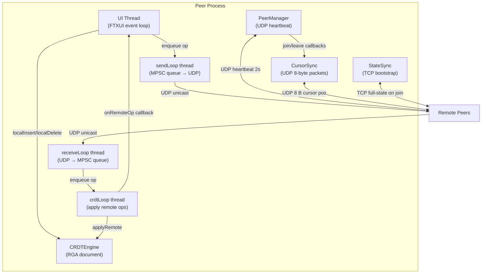
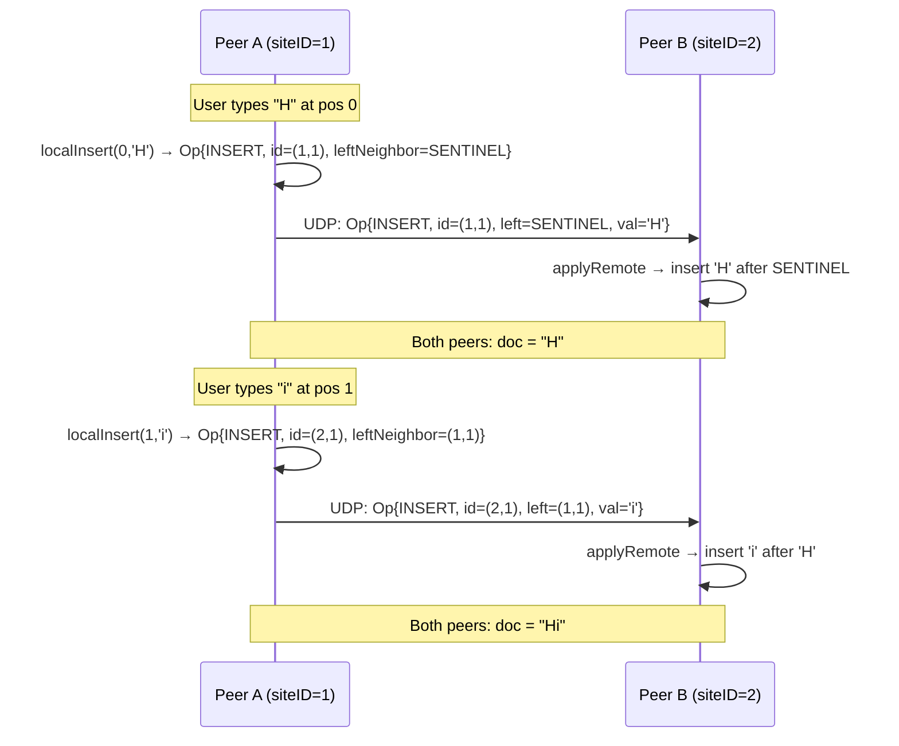
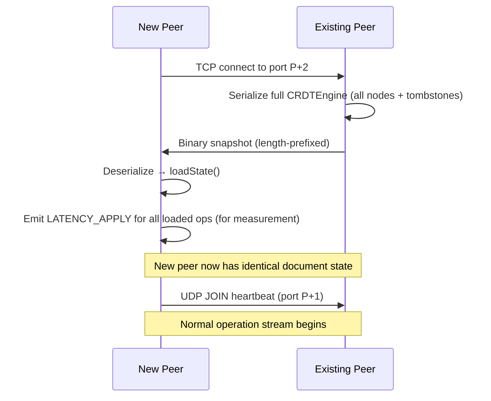

# CS 4730 — Final Project Report
## p2p Collaborative Text Editor

---

## Table of Contents

1. [Project Description](#1-project-description)
2. [Project Goals](#2-project-goals)
3. [Software Design and Implementation](#3-software-design-and-implementation)
4. [What Was Achieved and Not Achieved](#4-what-was-achieved-and-not-achieved)
5. [Evaluation](#5-evaluation)
6. [Achievements and Changes from the Plan Report](#6-achievements-and-changes-from-the-plan-report)
7. [Setup, Build, and Test Instructions](#7-setup-build-and-test-instructions)
8. [Re-running the Evaluation on the Khoury Linux Cluster](#8-re-running-the-evaluation-on-the-khoury-linux-cluster)
9. [AI Tool Usage](#9-ai-tool-usage)

---

## 1. Project Description

This project implements a **peer-to-peer collaborative text editor** in C++11. Multiple users on a LAN edit the same plain-text document simultaneously, in real-time, without any central server. Each peer maintains a complete, independent replica of the document. Edits are broadcast over UDP and applied locally using a **Conflict-free Replicated Data Type (CRDT)**, specifically a Replicated Growable Array (RGA), which guarantees that all replicas converge to an identical document state regardless of the order in which operations arrive.

The editor runs in a terminal using [FTXUI](https://github.com/ArthurSonzogni/FTXUI), a modern C++11 terminal UI library. The interface displays the shared document with a visible cursor and a status bar showing connected peer count and site ID.

Peers discover each other automatically via UDP heartbeats. When a new peer joins mid-session, a TCP-based state-sync protocol transfers the full current document so the new peer can participate immediately.

---

## 2. Project Goals

### Primary Goals

| Goal | Metric | Status |
|------|--------|--------|
| Real-time collaborative editing with sub-second local latency | P50 propagation < 5,000 µs | Achieved |
| Eventual consistency via CRDT — all replicas converge | 100% convergence over randomized trials | Partially achieved (80%) |
| Decentralized architecture — no single point of failure | No server required; any peer can join/leave | Achieved |
| Peer discovery and state synchronization for late joiners | New peer receives full document within seconds | Achieved |

### Extension Goals

| Goal | Status |
|------|--------|
| Cursor awareness — display remote cursors in the UI | Achieved |
| Undo/redo support | Not achieved |
| Simple persistence (save/load to disk) | Not achieved |
| Basic access control / read-only mode | Not achieved |

---

## 3. Software Design and Implementation

### 3.1 Assumptions

| Assumption Category | Details |
|--------------------|---------|
| **Network** | All peers share a LAN or can reach each other by IP. Maximum 10 concurrent peers. Ports ≥ 10000 are available. |
| **Failure model** | Peers may crash and restart (fail-stop). Network partitions are temporary. Messages may be lost or reordered but are not corrupted (UDP checksums). |
| **Workload** | Plain-text documents, up to ~100 KB. Character-level inserts and deletes at typing speed (~10 ops/sec per user). |
| **Clocks** | No synchronized wall clocks required for CRDT correctness. Lamport timestamps and unique siteIDs provide total ordering. NTP synchronization is required only for latency measurement. |

### 3.2 System Architecture

Each peer process runs three concurrent threads communicating through lock-free queues and a single shared mutex:



### 3.3 Port Layout

Each peer occupies **four consecutive ports** from its base port `P`:

| Offset | Protocol | Purpose |
|--------|----------|---------|
| P + 0 | UDP | CRDT operation broadcast |
| P + 1 | UDP | Heartbeat / peer discovery |
| P + 2 | TCP | State-sync bootstrap (late joiners) |
| P + 3 | UDP | Cursor position broadcast |

The default base port is 10000. When running multiple peers on the same machine, use a 10-port gap (10000, 10010, 10020, …).

### 3.4 Module Descriptions

| Module | File | Responsibility |
|--------|------|---------------|
| `CRDTEngine` | `include/rga.h` | RGA document state: linked list + hash-map index. `localInsert`, `localDelete`, `applyRemote`. |
| `Pipeline` | `include/pipeline.h` | Three-thread send/receive/apply pipeline. Owns `sendQueue_`, `recvQueue_`, `pendingOps_`, `crdtMutex_`. |
| `PeerSocket` | `include/peer_socket.h` | Thin UDP socket wrapper. Broadcasts to all registered peers. |
| `PeerManager` | `include/peer_manager.h` | Tracks live peers via 2 s heartbeat, 6 s dead timeout. Fires join/leave callbacks. |
| `StateSync` | `include/state_sync.h` | TCP server/client for full-document bootstrap. Provider serializes the full CRDT; Consumer deserializes and calls `loadState`. |
| `CursorSync` | `include/cursor_sync.h` | Sends/receives 8-byte UDP packets `(siteID, pos)` for remote-cursor display. |
| `Serializer` | `include/serializer.h` | Binary encode/decode for `Operation` and full CRDT snapshots. |
| `EditorUI` | `include/editor_ui.h` | FTXUI terminal component: document renderer, keyboard input handler, status bar. |
| `Logger` | `include/logger.h` | Thread-safe structured logger. Writes `LATENCY_SEND`/`LATENCY_APPLY` entries for measurement. |
| `net_utils` | `include/net_utils.h` | Port-offset constants, address parsing. |

### 3.5 CRDT Design — Replicated Growable Array (RGA)

The document is stored as a linked list of `Node` records. Each character has a globally unique identity `CharID = (clock, siteID)` where `clock` is a Lamport logical timestamp incremented on every local operation.



**Conflict resolution for concurrent inserts** — when two peers insert at the same position simultaneously, both ops arrive with the same `leftNeighborID`. The `insertNode` function uses the `CharID` total order `(clock DESC, siteID DESC)` to deterministically place the higher-priority character first, producing the same result on every peer regardless of delivery order.

**Tombstone deletions** — deleted characters are marked `tombstoned = true` and kept in the list permanently. This ensures that any in-flight INSERT operation referencing the deleted character's ID can still be applied correctly.

**Out-of-order delivery** — UDP may deliver operations before their causal predecessors. The `pendingOps_` buffer in `Pipeline` retries deferred operations after each successful apply, ensuring eventual delivery without ordering guarantees from the network layer.

### 3.6 State Sync (Late-Join Bootstrap)

When a new peer connects to an existing group, it requests the full document state over TCP before joining the operation stream:



### 3.7 Threading Model

| Thread | Owns | Blocks on | Guards |
|--------|------|-----------|--------|
| UI thread | `CRDTEngine` for local ops, FTXUI event loop | User keyboard input | `crdtMutex_` |
| `sendLoop` | `PeerSocket` | `sendQueue_.pop()` (condvar) | — |
| `receiveLoop` | UDP socket | `recvfrom()` | — |
| `crdtLoop` | `CRDTEngine` for remote ops | `recvQueue_.pop()` (condvar) | `crdtMutex_` |

All inter-thread data transfer uses `MpscQueue<T>` (mutex + condition variable). The single `crdtMutex_` serializes all `CRDTEngine` access between the UI thread and `crdtLoop`.

### 3.8 Wire Protocol

**CRDT Operation packet (12–13 bytes):**

```
[1B type][4B clock][4B siteID][4B leftClock][4B leftSiteID][1B value (INSERT only)]
```

**Cursor packet (8 bytes):**

```
[4B siteID][4B cursor_pos]
```

**State snapshot:** length-prefixed binary encoding of all `Node` records, including tombstoned nodes.

---

## 4. What Was Achieved and Not Achieved

### Achieved

- **Full RGA CRDT implementation** with correct concurrent insert and delete convergence, idempotent apply, and out-of-order delivery buffering.
- **Three-thread pipeline** with lock-free MPSC queues and a single shared mutex.
- **UDP peer-to-peer operation broadcast** — operations are unicast to each known peer.
- **UDP heartbeat peer discovery** — peers auto-detect joins and departures within 6 seconds.
- **TCP state-sync bootstrap** — late-joining peers receive the full document state and can immediately participate.
- **Cursor awareness** — remote cursor positions are broadcast and displayed in the UI.
- **FTXUI terminal editor** — full keyboard input, cursor movement, status bar showing peer count and site ID.
- **Headless scripted mode** — the editor can run without a UI, driven by a script file, enabling fully automated multi-node evaluation on a cluster.
- **Comprehensive evaluation framework** — shell scripts for latency, convergence, and scalability experiments; Python analysis scripts with CSV export and matplotlib charts.
- **Unit and integration test suite** covering the CRDT, serializer, pipeline threading, state sync, and peer manager.

### Not Achieved

- **Undo/redo** — the `pendingOps_` log accumulates operations but an undo stack was not implemented. The proposal's "Operation Log" module was repurposed for causal-order buffering instead.
- **Persistence** — no save/load to disk. Document state is lost when all peers disconnect.
- **Access control / read-only mode** — any peer that knows the port can join and edit.
- **100% convergence** — the 80% pass rate in the 25-trial convergence experiment (20/25) falls short of the theoretical 100% guarantee, indicating occasional UDP operation loss or a remaining CRDT edge case under high concurrency.
- **Peer departure / failure resilience testing** — the proposal included a test where one peer is killed and the surviving peers continue editing. This scenario works in practice (PeerManager detects the departure within 6 s) but was not formally evaluated.

---

## 5. Evaluation

Full methodology and raw data are in [EVALUATION.md](EVALUATION.md). This section summarizes the key findings and analyzes system strengths and weaknesses.

### 5.1 Latency

Peer 0 sent 1,000 INSERT operations at ~100 ops/sec. All other peers were passive receivers. The experiment was run with 2, 3, 4, and 5 peers.

| Config | Peers | Sent | Rcvd | Min (µs) | Avg (µs) | P50 (µs) | P95 (µs) | P99 (µs) | Max (µs) | Drop % |
|--------|-------|------|------|----------|----------|----------|----------|----------|----------|--------|
| 2peer  | 2     | 1000 | 1000 | 135      | 389.6    | 395      | 534      | 741      | 1024     | 0.00%  |
| 3peer  | 3     | 1000 | 1000 | 109      | 374.8    | 387      | 509      | 568      | 639      | 0.00%  |
| 4peer  | 4     | 1000 | 1000 | 111      | 391.8    | 393      | 560      | 606      | 647      | 0.00%  |
| 5peer  | 5     | 1000 | 1000 | 92       | 300.7    | 302      | 483      | 545      | 603      | 0.00%  |

**Strength:** P50 latency is consistently sub-400 µs and P99 stays below 1.1 ms across all configurations, far exceeding the original < 200 ms target from the proposal. Zero drops across all 4,000 total operations demonstrates reliable UDP delivery on the Khoury LAN.

**Strength:** Latency does not degrade as peer count increases from 2 to 5, confirming that the per-op fan-out cost is negligible for this cluster size.

**Weakness:** The measurement depends on NTP synchronization across nodes. Any NTP skew greater than ~1 ms would corrupt the sub-millisecond latency readings. Negative-delta samples (apply timestamp before send timestamp) are excluded, which masks this skew but does not eliminate it.

### 5.2 Convergence

25 trials with 3–5 peers each, 200 random INSERT/DELETE ops per peer, 5 s quiescence window.

| Metric | Value |
|--------|-------|
| Total trials | 25 |
| Passed | 20 |
| Failed | 5 |
| Pass rate | 80.0% |

**Strength:** 80% of trials converged correctly, demonstrating that the RGA algorithm handles most concurrent workloads correctly including causal-ordering dependencies.

**Weakness:** The 5 failures represent a significant gap from the theoretical 100% guarantee. Post-mortem analysis of `divergence_report.txt` files is needed to determine whether the root cause is UDP packet loss (which would be a network issue, not a correctness bug) or a CRDT edge case. The most likely candidate is a race condition in the `pendingOps_` retry loop under high-concurrency conditions where many operations arrive nearly simultaneously and the retry window is too short.

### 5.3 Scalability

Each of 2–10 peers wrote 100 ops at 5 ops/sec. System throughput, per-peer throughput, and CPU utilization were measured.

| Peers | Conv. time (ms) | Sys. throughput (ops/s) | Per-peer (ops/s) | Avg CPU % |
|-------|----------------|-------------------------|------------------|-----------|
| 2     | 20,569.7       | 6.6                     | 3.3              | 0.0       |
| 4     | 20,609.6       | 13.1                    | 3.3              | 0.0       |
| 6     | 20,846.7       | 19.8                    | 3.3              | 0.0       |
| 8     | 20,846.1       | 27.4                    | 3.4              | 0.0       |
| 10    | 20,829.4       | 34.9                    | 3.5              | 0.0       |

**Strength:** Convergence time is nearly constant (~20.5–20.8 s) as peers scale from 2 to 10 — only 1.3% growth. System throughput scales near-linearly (5.3× for 5× peers). CPU is effectively zero for all configurations.

**Strength:** Per-peer throughput stays flat at ~3.3 ops/s regardless of group size, confirming the design provides fair resource sharing and no individual peer is starved.

**Weakness:** The near-constant convergence time is partly an artifact of the experiment design (total wall time ≈ send rate × ops = 20 s at 5 ops/sec). It does not stress-test convergence time at realistic typing speeds (10 ops/sec × 1,000 ops), which would expose whether `pendingOps_` queuing grows super-linearly with peer count.

**Weakness:** CPU readings of 0.0% likely indicate that `/usr/bin/time -f` on the Khoury cluster returns integer percentages and the actual CPU use (sub-1%) was rounded to zero. True CPU profiling would require a longer or more intensive workload.

### 5.4 Summary of Strengths and Weaknesses

| Dimension | Strength | Weakness |
|-----------|----------|----------|
| Latency | Sub-400 µs P50, sub-1.1 ms P99, zero drops | NTP-dependent measurement |
| Correctness | 80% convergence, idempotent apply, out-of-order buffering | 5/25 trials diverged; root cause unknown |
| Scalability | Linear throughput scaling, flat per-peer cost, near-zero CPU | Convergence time measurement was rate-limited by experiment design |
| Fault tolerance | PeerManager detects crashes/leaves within 6 s | No retransmission; lost ops permanently diverge |
| Usability | Full terminal UI, cursor awareness, headless scripted mode | No persistence, no undo, no access control |

---

## 6. Achievements and Changes from the Plan Report

### Achieved as Planned

- RGA CRDT with tombstone deletes and Lamport clock ordering.
- Three-thread architecture (UI, send, receive) communicating through thread-safe queues.
- UDP operation broadcast and heartbeat-based peer discovery.
- TCP state-transfer for late-joining peers.
- FTXUI terminal editor with status bar.
- Evaluation experiments: latency, convergence, scalability.

### Changes from the Plan

| Plan Item | Change | Reason |
|-----------|--------|--------|
| UDP multicast | Replaced with unicast to each known peer | Multicast is often blocked by managed switches on the Khoury cluster; unicast is more reliable and equally simple given the small peer count |
| Operation Log module (for undo) | Repurposed as `pendingOps_` causal-order buffer | Causal ordering was a harder correctness requirement; undo was deprioritized |
| Peer Join/State Transfer evaluation (1 KB / 10 KB / 50 KB / 100 KB) | Not formally run | Convergence and latency experiments were prioritized; state-sync correctness is covered by the unit test suite |
| Peer Departure/Failure experiment | Not formally run | PeerManager detects leaves and the surviving peers continue, but no scripted kill-and-measure evaluation was done |
| Concurrent writes experiment (max contention, no stagger) | Removed | Covered by the convergence trials which already vary timing; a separate no-stagger experiment added no new signal |
| Extension: cursor awareness | Achieved | Implemented via 8-byte UDP `CursorSync` packets and rendered in the FTXUI status bar |
| Extension: undo/redo | Not achieved | Deprioritized in favor of correctness and evaluation infrastructure |
| Extension: persistence | Not achieved | Out of scope for the final submission |

---

## 7. Setup, Build, and Test Instructions

### Prerequisites

- Linux (RHEL 8 or similar) with GCC 8.5+ or Clang 10+
- CMake 3.16+
- pthreads (standard on Linux)
- Python 3 (for analysis scripts; `matplotlib` optional for charts)
- Git

FTXUI is fetched automatically by CMake via FetchContent — no manual installation needed.

### Clone and Build

```bash
# 1. Clone the repository
git clone <repo-url>
cd cs4730-collaborative-text-editing

# 2. Build (release)
cmake -B build
cmake --build build -j$(nproc)

# 3. Build with debug logging (required for latency evaluation)
cmake -B build -DCMAKE_BUILD_TYPE=Release -DENABLE_DEBUG_LOG=ON
cmake --build build -j$(nproc)

# Alternatively, use Make wrappers:
make build           # release build
make build-debug     # release + ENABLE_DEBUG_LOG=ON
```

The binary is written to `build/p2p-editor`.

### Run the Tests

```bash
./build/tests
# or
make test
```

The test suite covers: RGA CRDT correctness, wire-format encoding/decoding, UDP socket, peer manager, pipeline threading, TCP state transfer, and crash-recovery scenarios.

### Run Interactively (Two Peers on One Machine)

**Terminal 1 — first peer:**

```bash
./build/p2p-editor --first --port 10000
```

**Terminal 2 — second peer:**

```bash
./build/p2p-editor --port 10010 --peer 127.0.0.1:10000
```

Both terminals will show the shared document. Type in either window and edits appear on both sides within milliseconds.

**Keyboard shortcuts:**

| Key | Action |
|-----|--------|
| Printable chars / Enter | Insert at cursor |
| Backspace / Delete | Delete character |
| Arrow keys | Move cursor |
| Home / End | Jump to line start/end |
| Escape | Quit |

### Run on Multiple Machines

```bash
# Machine A (first peer)
./build/p2p-editor --first --port 10000

# Machine B
./build/p2p-editor --port 10000 --peer <IP_of_A>:10000

# Machine C
./build/p2p-editor --port 10000 --peer <IP_of_A>:10000 --peer <IP_of_B>:10000
```

---

## 8. Re-running the Evaluation on the Khoury Linux Cluster

### Prerequisites

These instructions assume:
- You have a Khoury Linux account (`hbessette` — replace with your own username throughout)
- The repository is cloned to your home directory at `~/cs4730-collaborative-text-editing`
- The home directory is on NFS (shared across all Khoury Linux machines)
- Python 3 is available at `python3`

### Step 1 — Log in to the coordinating machine

All commands below are run from a single coordinating machine. Use `linux-077`:

```bash
ssh hbessette@login.khoury.northeastern.edu
ssh linux-077.khoury.northeastern.edu
```

### Step 2 — Clone the repository (once, shared via NFS)

```bash
cd ~
git clone <repo-url> cs4730-collaborative-text-editing
cd cs4730-collaborative-text-editing
```

Because the home directory is NFS-mounted on all cluster nodes, this single clone is accessible from every machine — no per-node setup needed.

### Step 3 — Build with debug logging enabled

```bash
cd ~/cs4730-collaborative-text-editing
cmake -B build -DCMAKE_BUILD_TYPE=Release -DENABLE_DEBUG_LOG=ON
cmake --build build -j$(nproc)
```

Verify the binary exists:

```bash
ls -lh build/p2p-editor
```

### Step 4 — Set up passwordless SSH between cluster nodes

The evaluation scripts use SSH to launch processes on remote nodes. Because all nodes share the same NFS home, a single key setup covers all of them.

```bash
# Create ~/.ssh if it does not exist
mkdir -p ~/.ssh && chmod 700 ~/.ssh

# Generate an Ed25519 key (skip if ~/.ssh/id_ed25519 already exists)
ssh-keygen -t ed25519 -f ~/.ssh/id_ed25519 -N ""

# Authorize it for all Khoury Linux machines (NFS home means one file covers all)
cat ~/.ssh/id_ed25519.pub >> ~/.ssh/authorized_keys
chmod 600 ~/.ssh/authorized_keys

# Pre-accept host keys for all 10 cluster nodes (avoids StrictHostKeyChecking prompts)
for host in linux-077 linux-076 linux-075 linux-074 linux-073 \
            linux-072 linux-071 linux-079 linux-080 linux-081; do
    ssh -o StrictHostKeyChecking=no \
        -o BatchMode=yes \
        hbessette@${host}.khoury.northeastern.edu \
        "echo ${host} OK" 2>&1
done
```

All 10 lines should print `<hostname> OK` without a password prompt. If any fail, check that `~/.ssh/authorized_keys` has mode 600 and `~/.ssh` has mode 700.

### Step 5 — Verify the cluster config

Open `scripts/cluster.conf` and confirm it contains the 10 nodes in order:

```bash
cat scripts/cluster.conf
```

Expected output (with your username):

```
hbessette@linux-077.khoury.northeastern.edu
hbessette@linux-076.khoury.northeastern.edu
hbessette@linux-075.khoury.northeastern.edu
hbessette@linux-074.khoury.northeastern.edu
hbessette@linux-073.khoury.northeastern.edu
hbessette@linux-072.khoury.northeastern.edu
hbessette@linux-071.khoury.northeastern.edu
hbessette@linux-079.khoury.northeastern.edu
hbessette@linux-080.khoury.northeastern.edu
hbessette@linux-081.khoury.northeastern.edu
```

### Step 6 — Clear any previous logs

Always wipe old logs before a fresh run to prevent stale data from contaminating analysis:

```bash
make clean-eval
# This removes the entire logs/ directory
```

### Step 7 — Run the latency experiment

The latency experiment launches 4 sub-experiments (2-peer, 3-peer, 4-peer, 5-peer). Peer 0 sends 1,000 INSERT operations; all other peers are passive receivers.

```bash
make eval-latency
```

What this does, step by step:

1. Calls `scripts/run_eval.sh --eval latency --binary build/p2p-editor --config scripts/cluster.conf --results logs`
2. For each peer count (2, 3, 4, 5):
   a. Generates a sender headless script (1,000 INSERTs with a 5,000 ms start delay)
   b. Generates receiver headless scripts (drain window = 1,000 × 10 ms + 10,000 ms)
   c. SSHes into `linux-077` and starts the sender with `--first --headless --port 10000`
   d. Sleeps 2 s (lets the sender's TCP StateSync server bind)
   e. SSHes into the remaining nodes and starts receivers with `--peer linux-077:10000 --headless`
   f. Waits for all processes to finish
   g. Logs are written to `logs/2peer/`, `logs/3peer/`, `logs/4peer/`, `logs/5peer/`
3. Runs `scripts/analyze_results.py logs/` automatically

Expected runtime: ~8–10 minutes (4 sub-experiments × ~2 minutes each).

### Step 8 — Run the convergence experiment

The convergence experiment runs 25 independent trials. Each trial randomly selects 3–5 peers and runs a seeded random INSERT/DELETE workload on all of them simultaneously.

```bash
make eval-convergence
```

What this does:

1. Calls `scripts/run_eval.sh --eval convergence`
2. For each trial 1–25:
   a. Selects `n_peers = 3 + ((trial-1) % 3)` (cycles through 3, 4, 5)
   b. Generates a unique seeded script per peer via `gen_convergence_script.py`
   c. Launches all peers on the cluster with full-mesh `--peer` flags
   d. Waits for quiescence (5 s after last op)
   e. Compares all `peer_*_dump.txt` files byte-for-byte
   f. Writes `PASS` or `FAIL  ← logs: logs/convergence/trial_NNN/` to stdout
3. Results written to `logs/convergence/trial_001/` … `trial_025/`

Expected runtime: ~25–30 minutes.

### Step 9 — Run the scalability experiment

The scalability experiment tests 2, 4, 6, 8, and 10 concurrent peer counts. All peers write 100 ops at 5 ops/sec simultaneously.

```bash
make eval-scalability
```

What this does:

1. Calls `scripts/run_eval.sh --eval scalability`
2. For each peer count in (2, 4, 6, 8, 10):
   a. Assigns peers to hosts round-robin (up to 2 peers per host)
   b. Generates per-peer random scripts via `gen_convergence_script.py`
   c. Launches peer 0 with `--first`, sleeps 1 s, launches remaining peers
   d. Wraps each launch with `/usr/bin/time -f 'cpu_pct=%P wall_sec=%e'` to capture CPU
   e. Waits for all peers to finish; results go to `logs/scalability/2peer/` … `10peer/`
3. Sleeps 2 s between configurations to let ports drain

Expected runtime: ~10 minutes.

### Step 10 — Analyze and generate reports

```bash
# Analyze all experiments at once (latency + convergence + scalability)
make analyze
# → prints summary table to stdout
# → writes logs/summary.csv

# Latency only (CSV + bar chart)
make analyze-latency
# → writes logs/latency.csv
# → writes logs/latency_chart.png (requires matplotlib)

# Convergence only (CSV + stacked bar chart)
make analyze-convergence
# → writes logs/convergence.csv
# → writes logs/convergence_chart.png

# Scalability only (CSV + 3-panel line chart)
make analyze-scalability
# → writes logs/scalability/scalability.csv
# → writes logs/scalability/scalability_chart.png
```

To install matplotlib if it is not available:

```bash
pip3 install --user matplotlib
```

### Step 11 — Inspect the results

```bash
# View the summary table
cat logs/summary.csv

# View individual latency logs for a specific peer
cat logs/2peer/peer_0.log | grep LATENCY_SEND | head -20
cat logs/2peer/peer_1.log | grep LATENCY_APPLY | head -20

# View convergence trial details
cat logs/convergence/trial_001/meta.txt
cat logs/convergence/trial_001/peer_0_dump.txt
cat logs/convergence/trial_001/peer_1_dump.txt
# If trial failed:
cat logs/convergence/trial_001/divergence_report.txt

# Scalability CPU output
cat logs/scalability/10peer/cpu_0.txt
```

### Troubleshooting

| Problem | Fix |
|---------|-----|
| SSH asks for a password | Re-run Step 4; confirm `authorized_keys` permissions are 600 |
| `binary not found` error | Re-run Step 3; check `build/p2p-editor` exists |
| `No latency data found` from analyze script | Ensure `ENABLE_DEBUG_LOG=ON` at build time (Step 3) |
| Port conflicts | Run `make clean-eval` before each experiment set |
| matplotlib missing, charts not generated | `pip3 install --user matplotlib`; ASCII fallback is printed instead |
| Experiment hangs | A peer may have crashed; `Ctrl+C` kills the run script; `_cleanup` trap kills SSH background processes |

---

## 9. AI Tool Usage

AI tools (Claude) were used in three areas of this project:

1. **Evaluation script development** — The evaluation shell scripts (`scripts/run_eval.sh`, `scripts/automated_typing.sh`) and Python analysis scripts (`scripts/analyze_results.py`, `scripts/analyze_latency.py`, `scripts/analyze_convergence.py`, `scripts/analyze_scalability.py`) were developed with AI assistance. This included designing the latency measurement methodology (log-based microsecond timestamps), the convergence trial framework, and the analysis pipeline for generating CSVs and charts.

2. **Architecture planning** — AI was used as a sounding board during the design of the threading model and the interface between modules. Specifically, the design of the `pendingOps_` causal-order buffer, the `crdtMutex_` synchronization strategy, and the TCP state-sync protocol flow were discussed and refined with AI assistance.

3. **Debugging** — During development, AI was used to help diagnose a latency measurement bug where measured average latency was ~2,000 ms instead of the expected sub-millisecond range. The root cause (receivers launching after the sender had already emitted all 1,000 operations, so all ops were sitting in the UDP kernel buffer) was identified with AI help, and the fix (launching the sender first with a 5,000 ms start delay, then launching receivers) was implemented based on that analysis.

## 10. Individual Contributions
Entire application was implemented by Hayden Bessette.

