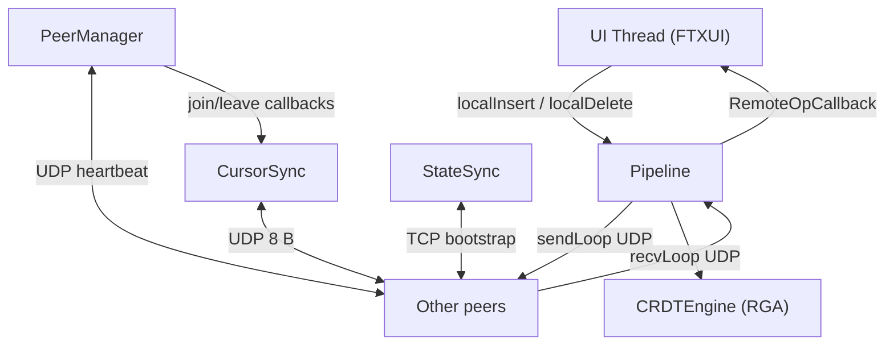

# p2p Collaborative Text Editor

A peer-to-peer collaborative text editor written in C++11. Multiple peers edit the same document simultaneously over a LAN or cluster. Conflicts are resolved automatically using a **Replicated Growable Array (RGA) CRDT** — every peer converges to the same document with no central server.

See [ARCHITECTURE.md](ARCHITECTURE.md) for a detailed description of every module, the data-flow pipeline, and the CRDT algorithm. See [EVALUATION.md](EVALUATION.md) for methodology and results.

## Architecture overview



Each peer instance occupies **four consecutive ports** starting from `--port P`:

| Port  | Protocol | Purpose                        |
|-------|----------|--------------------------------|
| P     | UDP      | CRDT operations                |
| P+1   | UDP      | Heartbeat / peer discovery     |
| P+2   | TCP      | State sync (late-join bootstrap)|
| P+3   | UDP      | Cursor position broadcast      |

## Dependencies

- CMake 3.16+
- A C++11-capable compiler (GCC, Clang)
- pthreads (standard on Linux/macOS)
- [FTXUI](https://github.com/ArthurSonzogni/FTXUI) — fetched automatically via CMake FetchContent

## Build

```bash
cmake -B build
cmake --build build
```

Or via Make:

```bash
make build          # release build
make build-debug    # with debug logging (ENABLE_DEBUG_LOG=ON)
```

**CMake options:**

| Option | Default | Effect |
|--------|---------|--------|
| `ENABLE_DEBUG_LOG` | OFF | Compile per-operation DEBUG log entries (needed for latency analysis) |
| `ENABLE_ASAN` | OFF | Build with AddressSanitizer (tests only) |
| `ENABLE_TSAN` | OFF | Build with ThreadSanitizer (tests only) |

## Run

### Starting the first peer

The first peer starts the document. Use `--first` to skip the initial state sync:

```bash
./build/p2p-editor --first
```

You can optionally specify a port (default is 10000):

```bash
./build/p2p-editor --first --port 10000
```

### Joining as a subsequent peer

Additional peers connect by providing the address of any existing peer via `--peer`:

```bash
./build/p2p-editor --peer 127.0.0.1:10000
```

Use `--port` if you need a non-default port (required when running multiple peers on the same machine):

```bash
./build/p2p-editor --port 10010 --peer 127.0.0.1:10000
```

Multiple `--peer` flags can be provided:

```bash
./build/p2p-editor --port 10020 --peer 127.0.0.1:10000 --peer 127.0.0.1:10010
```

> **Cluster note:** The cluster only permits ports ≥ 10000. The default port is 10000. When running multiple peers on the same node, use a 10-port gap (e.g. 10000, 10010, 10020) to avoid collisions across the four-port range.

### Keyboard shortcuts

| Key                     | Action                          |
|-------------------------|---------------------------------|
| Printable chars / Enter | Insert at cursor                |
| Backspace / Delete      | Delete character                |
| Arrow keys              | Move cursor                     |
| Home / End              | Jump to line start / end        |
| Escape / Ctrl+X         | Quit (broadcasts LEAVE to peers)|

### Logging

By default, logs are written to `logs/<siteID>.log` in the current directory (the `logs/` folder is created automatically). Override the path with `--log-path FILE`:

```bash
./build/p2p-editor --first --port 10000
# → writes to logs/<siteHex>.log

./build/p2p-editor --port 10010 --peer 127.0.0.1:10000 --log-path /tmp/peer-B.log
# → writes to /tmp/peer-B.log
```

Log lines follow the format:

```
[YYYY-MM-DD HH:MM:SS.mmm] [LEVEL] [SITEHHEX] [module] message
```

Logged events include peer join/leave, state sync start/result, and (when debug logging is compiled in) every operation sent and received with a microsecond timestamp for latency measurement.

To correlate send and receive latency across peers, join `LATENCY_SEND` entries from one peer's log with `LATENCY_APPLY` entries from another on the same `siteID` + `clock` values.

#### Debug logging

Operation-level `DEBUG` entries are compiled out by default. Enable them at build time:

```bash
cmake -B build -DENABLE_DEBUG_LOG=ON
cmake --build build -j4
```

To build without debug logging (production):

```bash
cmake -B build -DENABLE_DEBUG_LOG=OFF
cmake --build build -j4
```

## Headless mode

The editor can run without a terminal UI, driven by a script file. This is used for automated testing and evaluation.

```bash
./build/p2p-editor --first --headless --script path/to/script.txt
```

Script commands (one per line; `#` and blank lines are ignored):

| Command            | Effect                                    |
|--------------------|-------------------------------------------|
| `INSERT <pos> <c>` | Insert character `c` at visible position `pos` |
| `DELETE <pos>`     | Delete character at visible position `pos` |
| `SLEEP <ms>`       | Sleep for `ms` milliseconds               |
| `DUMP`             | Print the current document to stdout      |
| `QUIT`             | Exit (EOF also exits)                     |

## Test

```bash
./build/tests
# or
make test
```

The test suite covers: RGA CRDT correctness, wire-format codecs, UDP socket, peer discovery, pipeline threading, TCP state transfer, and crash-recovery scenarios.

## Evaluation

Evaluations are run on a Linux cluster over SSH. All scripts live in `scripts/` and assume a shared NFS home directory (paths identical on every node). Timestamps use microsecond precision; cluster nodes must be NTP-synchronized.

See [EVALUATION.md](EVALUATION.md) for full methodology and results.

### Requirements

- Passwordless SSH from the coordinating machine to each cluster node
- The `p2p-editor` binary built and accessible at the same path on every node
- NTP-synchronized clocks
- Python 3

### SSH setup

**1. Create `.ssh` if needed:**

```bash
mkdir -p ~/.ssh && chmod 700 ~/.ssh
```

**2. Generate a key (skip if `~/.ssh/id_ed25519` already exists):**

```bash
ssh-keygen -t ed25519   # leave passphrase blank
```

**3. Authorize it:**

```bash
cat ~/.ssh/id_ed25519.pub >> ~/.ssh/authorized_keys
chmod 600 ~/.ssh/authorized_keys
```

Because the home directory is shared, this authorizes every cluster node at once.

**4. Test:**

```bash
ssh node01   # should connect without a password prompt
```

### Cluster config

Edit `scripts/cluster.conf` — one `user@hostname` per line. The first entry is peer 0 (sender/first-writer); the rest are additional peers.

```
user@node01
user@node02
user@node03
user@node04
user@node05
```

### Eval types

| Type | What it measures | Who writes |
|------|-----------------|------------|
| `latency` | Op propagation time from sender to receivers — 2/3/4/5-peer | Peer 0 only |
| `convergence` | CRDT correctness — 25 trials, 3–5 peers, random ops | All peers |
| `scalability` | Throughput, convergence time, CPU as peer count scales 2→10 | All peers |

### Run

```bash
# Latency — runs 2/3/4/5-peer sub-experiments
make eval-latency

# Convergence — 25 trials, 3–5 peers, 200 random insert/delete ops each
make eval-convergence

# Scalability — 2/4/6/8/10 peers, 100 ops @ 5 ops/sec
make eval-scalability

# Analyze all results
make analyze
```

### Analyze

```bash
python3 scripts/analyze_results.py logs/
# or
make analyze
```

Reports: sample count, drop rate, P50/P95/P99 latency per configuration, and convergence PASS/FAIL per trial.

```bash
python3 scripts/analyze_results.py logs/ --csv logs/summary.csv
```

### Collect results

```bash
make collect
# → logs/eval_<timestamp>.tar.gz
```

On non-NFS clusters:

```bash
./scripts/collect_results.sh --scp --config scripts/cluster.conf --results logs/
```

### Clear logs between runs

Log files accumulate across runs. Always clear before a fresh experiment:

```bash
make clean-eval
```

### Generating custom headless scripts

**Sequential scripts** (`scripts/automated_typing.sh`):

```bash
./scripts/automated_typing.sh --mode sender --ops 500 > my_sender.txt
./scripts/automated_typing.sh --mode receiver --start-delay 10000 > my_receiver.txt
```

**Random scripts** (`scripts/gen_convergence_script.py`):

```bash
python3 scripts/gen_convergence_script.py --ops 200 --seed 42 > peer0.txt
python3 scripts/gen_convergence_script.py --ops 200 --peer-id 1 --seed 43 > peer1.txt
```

## Project Structure

```
.
├── CMakeLists.txt
├── Makefile
├── include/           # Header files (all public interfaces)
│   ├── rga.h          # CRDT engine (RGA algorithm)
│   ├── pipeline.h     # Three-thread send/receive/apply pipeline
│   ├── serializer.h   # Wire-format codecs
│   ├── peer_manager.h # UDP heartbeat peer discovery
│   ├── peer_socket.h  # UDP socket abstraction
│   ├── state_sync.h   # TCP full-state bootstrap
│   ├── cursor_sync.h  # UDP cursor position broadcast
│   ├── editor_ui.h    # FTXUI terminal editor component
│   ├── logger.h       # Thread-safe structured logger
│   └── net_utils.h    # Port layout and address parsing
├── src/               # Application source files
│   └── p2p-editor.cpp # main() — startup, wiring, event loop
├── tests/             # Unit and integration test suite
├── scripts/           # Evaluation orchestration and analysis
└── docs/              # Additional documentation
```
